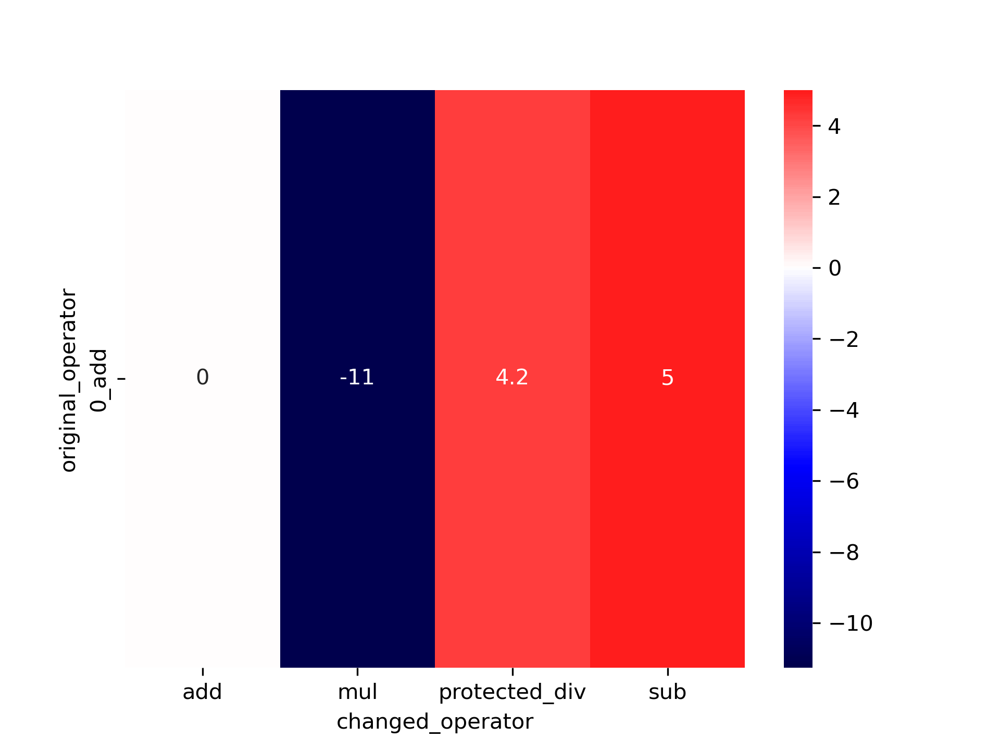
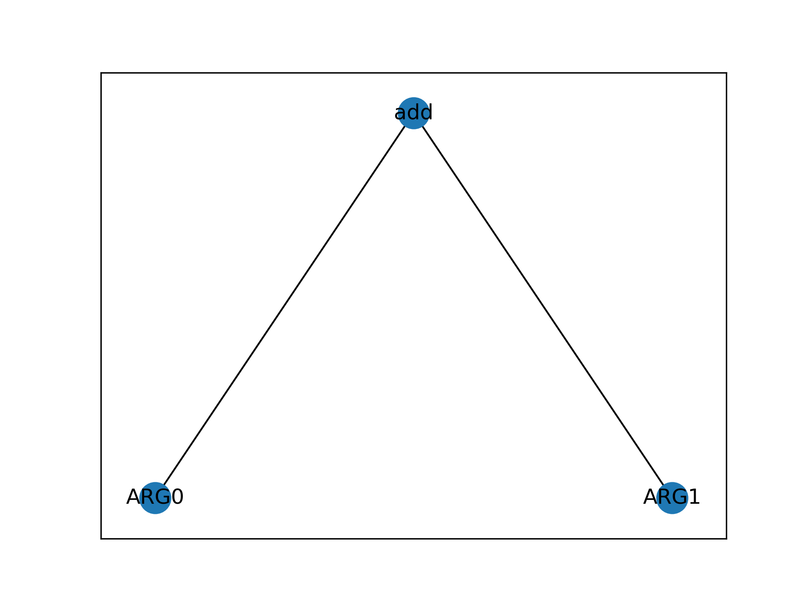

# genetic-programming

## Milestone X - 18.05.2023
| Example GP tree and heatmap for GCD with absolute loss |
|--------------------------------------------------------|
|                         |
|                         |

We tried to implement the epistasis calculation mechanism with accordance to the papers:
- [paper one](https://sci-hub.se/10.1109/4235.843491)
- [paper two](https://sci-hub.se/10.1016/b978-1-55860-356-1.50005-4)

## The Paper
https://arxiv.org/pdf/2111.07875.pdf

## Dataset
- paper: https://arxiv.org/pdf/2106.06086.pdf
- zenodo: https://zenodo.org/record/5084812

## (possibly) useful resource:
- http://www.gp-field-guide.org.uk/
- https://www.cs.put.poznan.pl/kkrawiec/wiki/uploads/Zajecia/ProgSynthSlides.pdf   :)
- https://alfagroup.csail.mit.edu/sites/default/files/documents/program_synthesis_novelty.pdf
- https://alfagroup.csail.mit.edu/sites/default/files/documents/2021.%20Getting%20a%20Head%20Start%20on%20Program%20Synthesis%20with%20Genetic%20Programming.pdf
