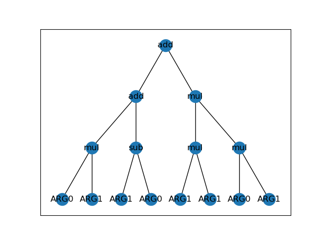
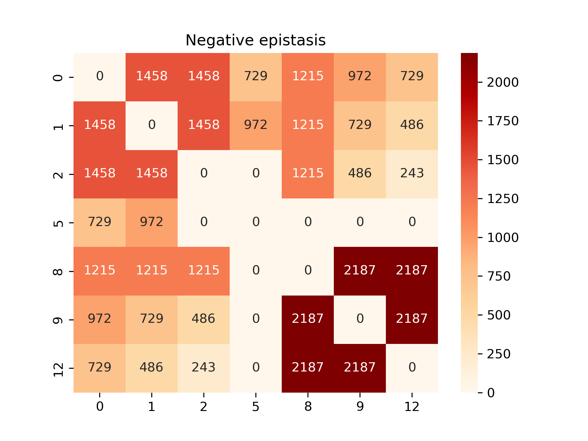

# genetic-programming

## Milestone X - 18.05.2023
We implemented calculation of epistasis matrix for a given tree. 
We compute the change in fitness between each pair of operators, and for each pair of nodes in the tree.
Therefore, for example, for operators [+, -, *] and tree consisting of three nodes, where initially we have
addition in the first node, subtraction in the second node and addition in the third node, we do the following:
- compute of pairs of changing the operator for a given node:
    
    so for our example we will have:
    - for the first node: [(+, -)1, (+, *)1]
    - for the second node: [(-, +)2, (-, *)2]
    - for the third node: [(\*, +)3, (\*, -)3]
- compute all combinations of such changes and compute epistasis matrix for the given list of changes:

    in our example we have 8 combinations:
    - [(+, -)1, (-, +)2, (\*, +)3]
    - [(+, -)1, (-, +)2, (\*, -)3]
    - [(+, -)1, (-, *)2, (\*, +)3]
    - [(+, -)1, (-, *)2, (\*, -)3]
    - [(+, *)1, (-, +)2, (\*, +)3]
    - [(+, *)1, (-, +)2, (\*, -)3]
    - [(+, *)1, (-, *)2, (\*, +)3]
    - [(+, *)1, (-, *)2, (\*, -)3]
    
  generally, for tree with n nodes and o operators given for the problem, we will have (o-1)n such combinations.

- after calculating the epistasis matrices for all combinations, we need to aggregate them somehow - so that they will show only nodes dependencies, not caring about the changes of specific operators:

    we implemented 3 ways of aggregating the matrices:

    - "absolute": all values for a given pair of nodes in all generated matrices must be either greater than zero for a given node (then we observe positive epistasis), less than zero (negative epistasis), or zero (no epistasis), for the cases when some values for a given node are positive and some are negative no decision about epistasis effect is made
    - "voting": for each pair of nodes we count the number of matrices in which epistasis was greater than zero, less than zero, equal to zero, the majority class wins
    - "mean": just simply takes the mean over all matrices, this approach displays some value of epistasis for each pair, but at the same time doesn't show the observed disagreements

Example GP tree and heatmaps (obtained matrices) for GCD with absolute loss can be observed below:

| Description                                                                   | Picture                       |
|-------------------------------------------------------------------------------|-------------------------------|
| GP tree                                                                       |       |
| Number of matrices with positive epistasis observed for a given pair of nodes |   |
| Number of matrices with no epistasis observed for a given pair of nodes       |        |
| Number of matrices with negative epistasis observed for a given pair of nodes |  |
| Aggregated matrix ("absolute")                                                |    |
| Aggregated matrix ("voting")                                                  |     |
| Aggregated matrix ("mean")                                                    |       |

## The Paper
https://arxiv.org/pdf/2111.07875.pdf

## Dataset
- paper: https://arxiv.org/pdf/2106.06086.pdf
- zenodo: https://zenodo.org/record/5084812

## (possibly) useful resource:
- http://www.gp-field-guide.org.uk/
- https://www.cs.put.poznan.pl/kkrawiec/wiki/uploads/Zajecia/ProgSynthSlides.pdf   :)
- https://alfagroup.csail.mit.edu/sites/default/files/documents/program_synthesis_novelty.pdf
- https://alfagroup.csail.mit.edu/sites/default/files/documents/2021.%20Getting%20a%20Head%20Start%20on%20Program%20Synthesis%20with%20Genetic%20Programming.pdf
